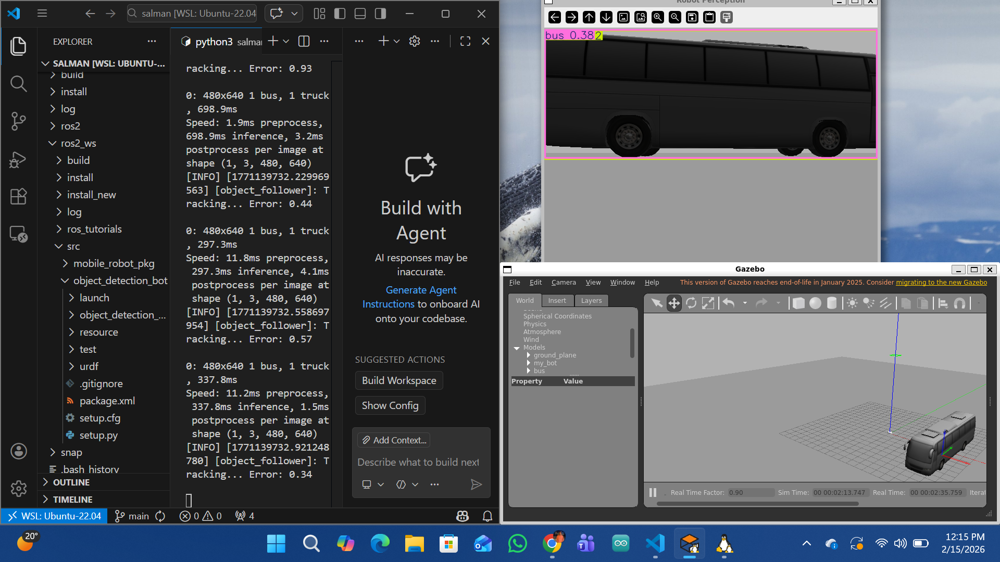

# Autonomous Vision-Based Tracking Robot (ROS 2 & YOLOv8) 🤖🚌

### *Mechatronics Engineering Project*

This project demonstrates an end-to-end autonomous robotics pipeline. It features a custom-designed differential-drive robot that perceives its environment through a simulated camera, processes visual data using a Deep Learning model (**YOLOv8**), and executes movement using a **Proportional (P) Control** algorithm in the Gazebo simulator.

---

## 📺 Simulation Gallery

| Status: Searching | Status: Tracking (Target: Bus) |
| :---: | :---: |
|  |  |
| *Robot scanning the environment for known classes.* | *AI identifying a bus and centering the robot's heading.* |

---

## 🛠️ Technical Architecture

### 1. Perception Layer (The "Eyes")
The robot uses a simulated monocular camera. The raw image stream is published to the `/camera/image_raw` topic.
* **Bridge:** The `cv_bridge` library converts ROS 2 Image messages into OpenCV format.
* **Inference:** The **YOLOv8 Nano** model performs real-time detection, providing bounding box coordinates ($x, y, w, h$) and class labels.

### 2. Control Logic (The "Brain")
I implemented a **Proportional (P) Controller** to handle the robot's angular velocity. The objective is to minimize the "Visual Error"—the distance between the center of the image and the horizontal center of the detected object.

**The Control Law:**


$$e(t) = \text{ImageCenter}_x - \text{ObjectCenter}_x$$
$$\omega(t) = K_p \cdot e(t)$$

* **Error ($e$):** Measured in pixels.
* **Gain ($K_p$):** Tuned to `0.005` to provide smooth rotation without oscillation.
* **Output ($\omega$):** Sent as `angular.z` via the `/cmd_vel` topic.

---

## 🚀 Features
* **Real-time Detection:** Capable of identifying 80+ object classes (Cones, Buses, People, etc.).
* **Custom URDF:** A 3-wheeled robot (2 drive wheels + 1 caster) modeled with accurate inertial properties.
* **Gazebo Integration:** Uses `libgazebo_ros_diff_drive` for physics and `libgazebo_ros_camera` for vision.

---

## 📦 Installation & Setup

### Prerequisites
* Ubuntu 22.04 (Jammy Jellyfish)
* ROS 2 Humble
* Python 3.10
* `ultralytics` (YOLOv8) & `opencv-python`

### Build Instructions
```bash
# Navigate to your workspace
cd ~/ros2_ws

# Build the package
colcon build --packages-select object_detection_bot

# Source the setup files
source install/setup.bash
